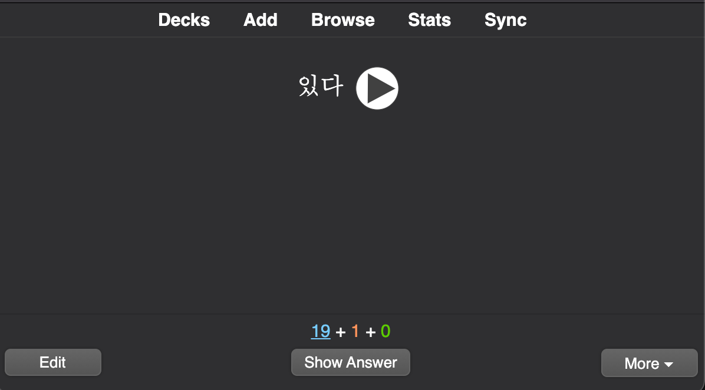

# Studying

## Decks

Study in Anki is <Color color="var(--secondary-font-color)"> limited to </Color> the currently selected deck as well as any subdecks it contains.

On the decks screen, your decks will be displayed in a list.

There are three columns.

1. `New`: is the number of new cards that are ready to be learnt that day.
1. `Learn`: shows the number of cards currently in learning.
1. `Due`: is the count of waiting reviews.

 Default view 

<Admonition type="tip" title="later">

You can click the gears button to the right of a deck to rename or delete a deck, change its [options](https://docs.ankiweb.net/deck-options.html), or [export](https://docs.ankiweb.net/exporting.html) it.

</Admonition>

## Study Overview

After clicking on a deck to study, you'll see a screen that shows you how many cards are due today.

 Deck overview 

This is called the 'deck overview' screen. The cards are split into three types:

- `New` refers to cards that you have downloaded or entered in, but have <Color color="var(--secondary-font-color)"> never been studied </Color> before.
- `Learning` refers to cards that were seen for the first time recently, and are <Color color="var(--secondary-font-color)"> still being learnt </Color>.
- `To Review` refers to cards that were <Color color="var(--secondary-font-color)"> previously learnt </Color>, and now <Color color="var(--secondary-font-color)"> need to be reviewed </Color> so you don't forget them.

To start a study session, click the `Study Now` button. Anki will proceed to show you cards until the cards to be shown for the day have run out.

<Admonition type="tip" title="tip">

While studying, you can return to the overview by pressing the `s` key on your keyboard.

</Admonition>

<Admonition type="tip" title="tip">

You can return to the deck list to change the currently selected deck at any time by clicking on `Decks` at the top of the main window.
( You can also use the Study Deck action in the menu to select a new deck from the keyboard, or you can press the `s` key to study the currently selected deck.)

</Admonition>

## Questions

When a card is shown, only the question is shown at first.

After thinking about the answer, either click the Show Answer button, or press the spacebar. The answer will then be shown.

 Question 

<Admonition type="note" title="note">

It's okay if it takes you a little while to recall the answer,
but as a general rule if you <Color color="var(--secondary-font-color)"> can't answer within about 10 seconds </Color>, it's probably <Color color="var(--secondary-font-color)"> better to give up </Color> and show the answer than keep struggling to remember.

</Admonition>

When the answer is shown, you should compare the answer you thought of with the answer which is shown and <Color color="var(--primary-font-color)"> tell Anki how well you remembered </Color>.

 Answer 

<Admonition type="tip" title="tip">

If you don't trust yourself to compare your answer accurately, you can ask Anki to [prompt](https://docs.ankiweb.net/templates/fields.html#checking-your-answer) you to type in the answer rather than just showing it to you.

</Admonition>

## Learning/Relearning Cards

When learning new cards, or when relearning cards that you have forgotten,
Anki will show you the cards one or more times to help you memorize them.

### Learning Steps

&#8203;<Color color="var(--writer-additional-note-font-color)"> //\\ </Color> Each card
has it own step. Its step will move up or move down depends on feedback that you
give Anki.

By default there are two steps:

- 1 minute
- 10 minutes.

When cards are seen for the first time, they start at step one.

### Giving learning feedback

There are four rating buttons when learning:

Each time you press `Good` during review, the card <Color color="var(--secondary-font-color)"> moves to the next step </Color>.

- `Again` moves the card back to the first step.
- `Hard` repeats the current step after the first step. `Hard` is the average of `Again` and `Good` on the first step.
- `Good` moves the card to the next step. If the card was on the final step, the card is converted into a review card (it 'graduates').
  By default, once the card has reached the end of the learning steps, the card will be shown again the next day, then at increasingly long delays (see the next section).
- `Easy` immediately converts the card into a review card, even if there were steps remaining.
  By default, the card will be shown again 4 days later, and then at increasingly long delays.

<Admonition type="info" title="info">

Answering `Good` on a card for the first time will show it one more time in 10 minutes, and the initial 1 minute step will be skipped.

If you push `Again`, though, the card will come back in 1 minute.

</Admonition>

#### Example

For example, let's say that your learning steps are 1m 10m 1d.

- When you press `Again`, the card goes back to first step, and will be shown again approximately 1 minute later.
- When you press `Good` on a new card, or a card answered Again, it will move to the next step, and be shown again in approximately 10 minutes.
- When you press `Good` on a card after the 10 minute step, it will be delayed until the next day.
- When you press `Good` on the card the next day, it will leave learning (i.e. it will graduate), and become a review card. It will be shown again after the delay configured by the graduating interval.

<Admonition type="note" title="note">

You can change the number of steps and the delays between them in the [deck options](https://docs.ankiweb.net/deck-options.html#new-cards).

</Admonition>

 

---

# Sources

- https://docs.ankiweb.net/studying.html
- https://docs.ankiweb.net/deck-options.html#learning-steps
